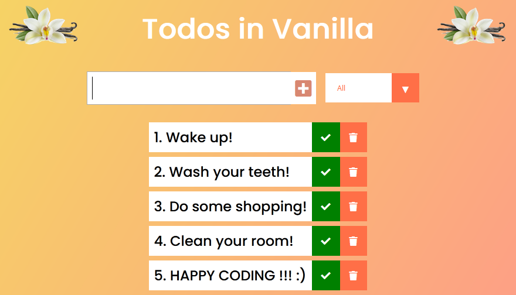

<h1 align="center">
    <strong>Todos in Vanilla</strong>
</h1>
<h3 align="center">
    TODO List written in plain VanillaJS
</h3>

## Features

* *Input field to add todo*
* *List of todos*
* *Todos can be checked for 'completed' and deleted*
* *Filter for 'All', 'Completed' and 'Uncompleted' Todos*
